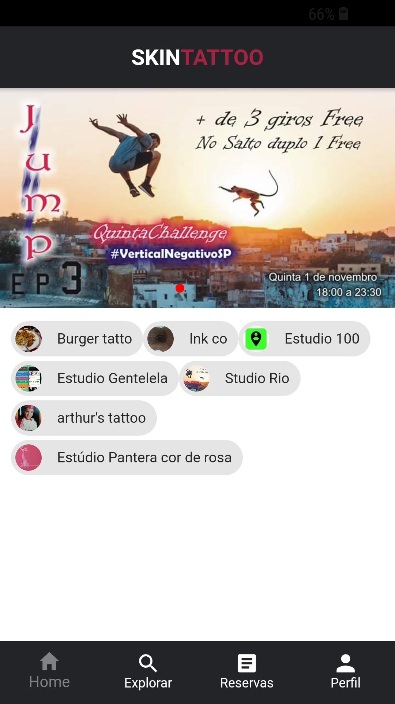
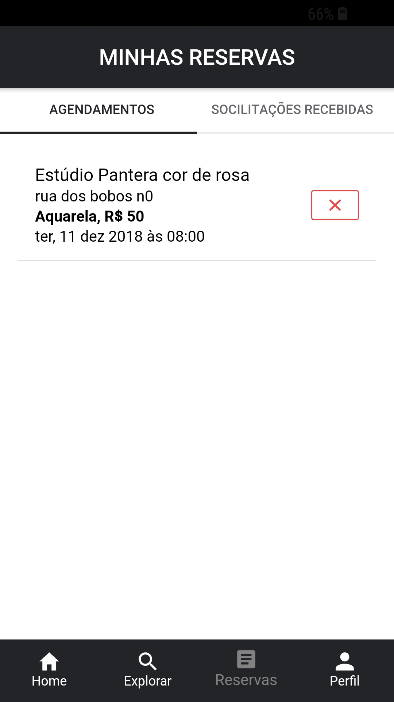
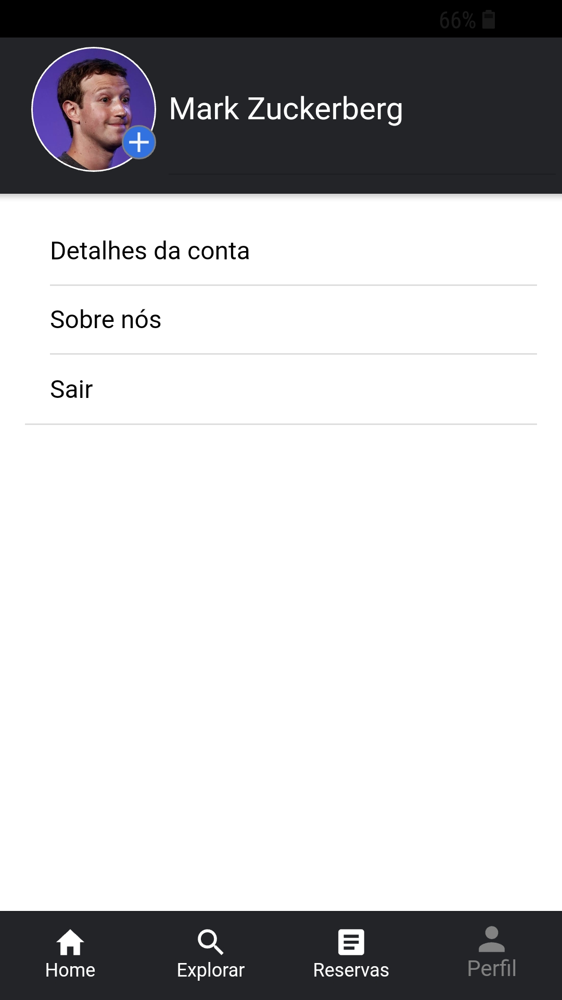
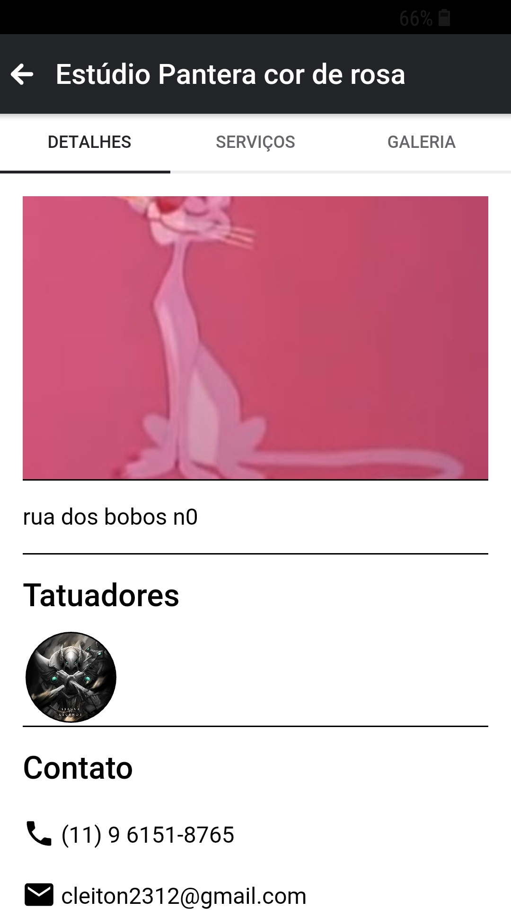
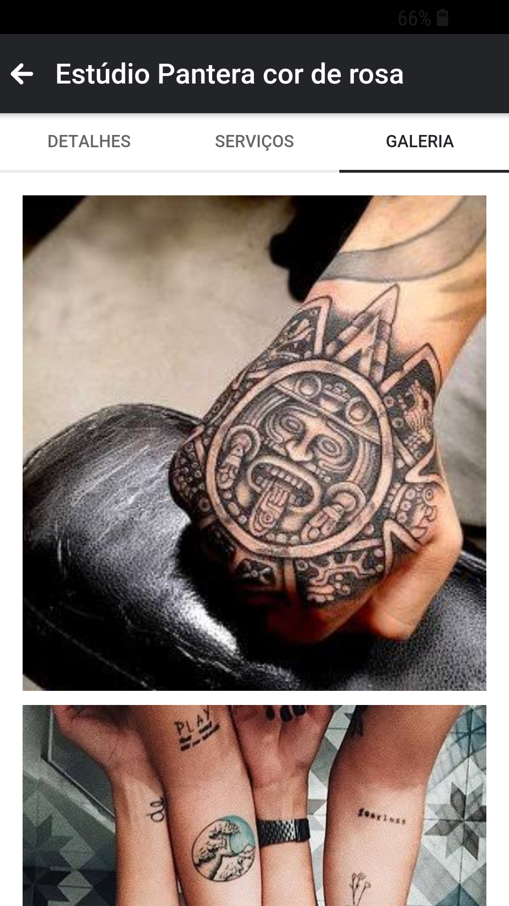
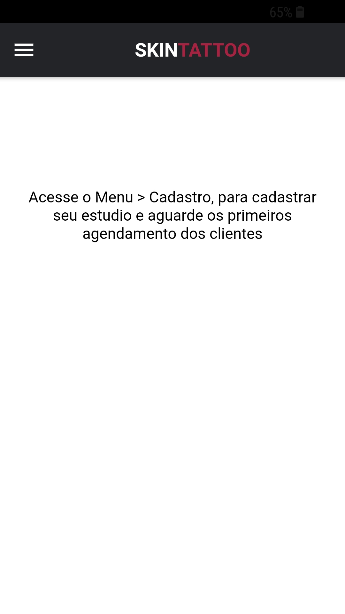
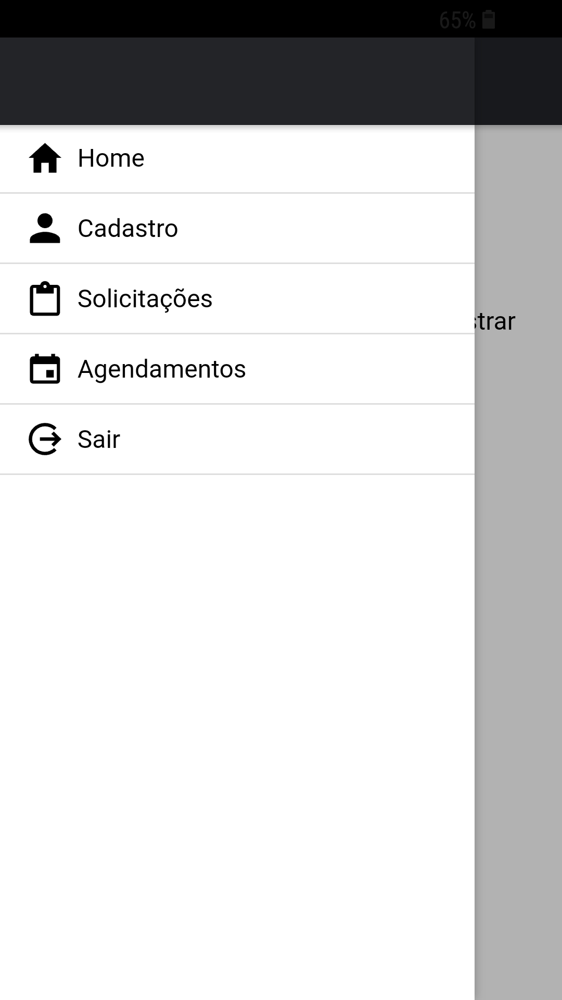
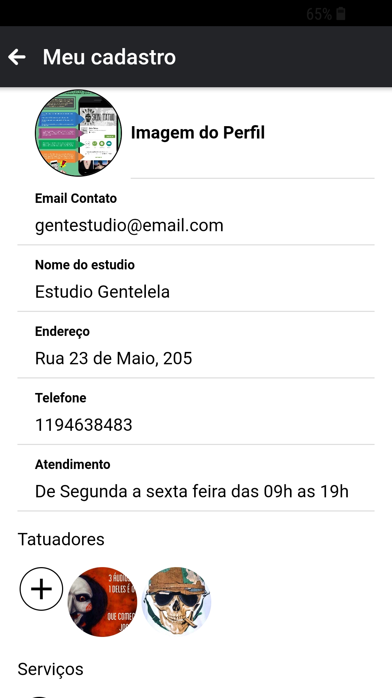

# Desaparecidos
App "Skintatoo" agendamento de tatuagens

**Procure e gente estudios e faça agendamento para fazer uma tatuagem **

<h2>App Cliente</h2>

  
  
  
  
  

<h2>App Estudios</h2>

    
    
    

**Tecnoligias usadas**

Ionic 4

Angular 6

CSS 3 

Firebase

